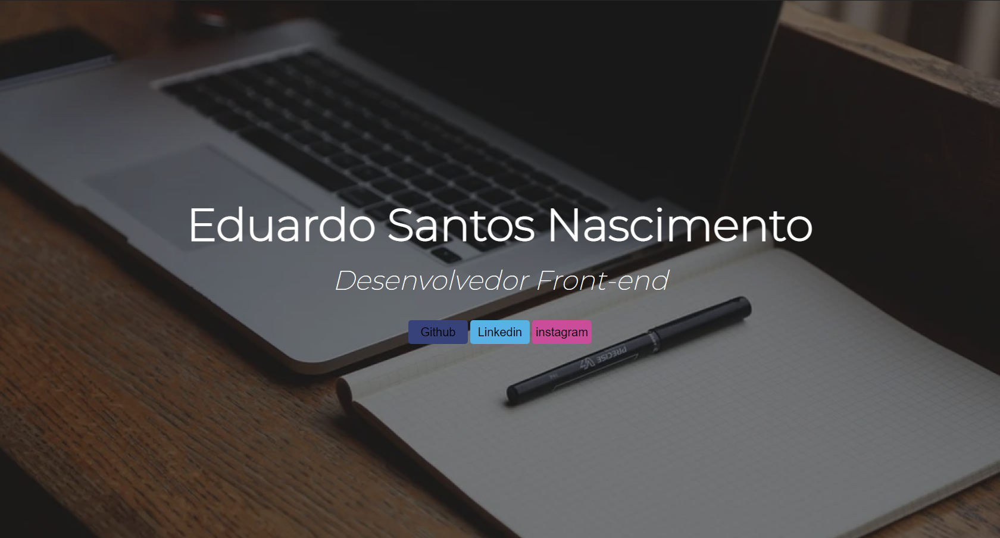

# Landing-Page
Primeiro website criado com fins didáticos para o curso de Desenvolvimento de Sistemas do [SENAI Jandira](https://jandira.sp.senai.br/), com orientação do professor Fernando Leonid.
## O que é uma Landing-Page
São páginas com foco principal em conversão de visitantes. Assim essas páginas de conversão que possuem poucos elementos comparados com páginas tradicionais, evitando distrações e garantindo o objetivo.
## WebSite
 O site pode ser acessado pelo link: [Eduardo Santos](https://edusan1.github.io/Landing-Page/)

## Ferramentas 
* HTML
* CSS

## Screnshot
